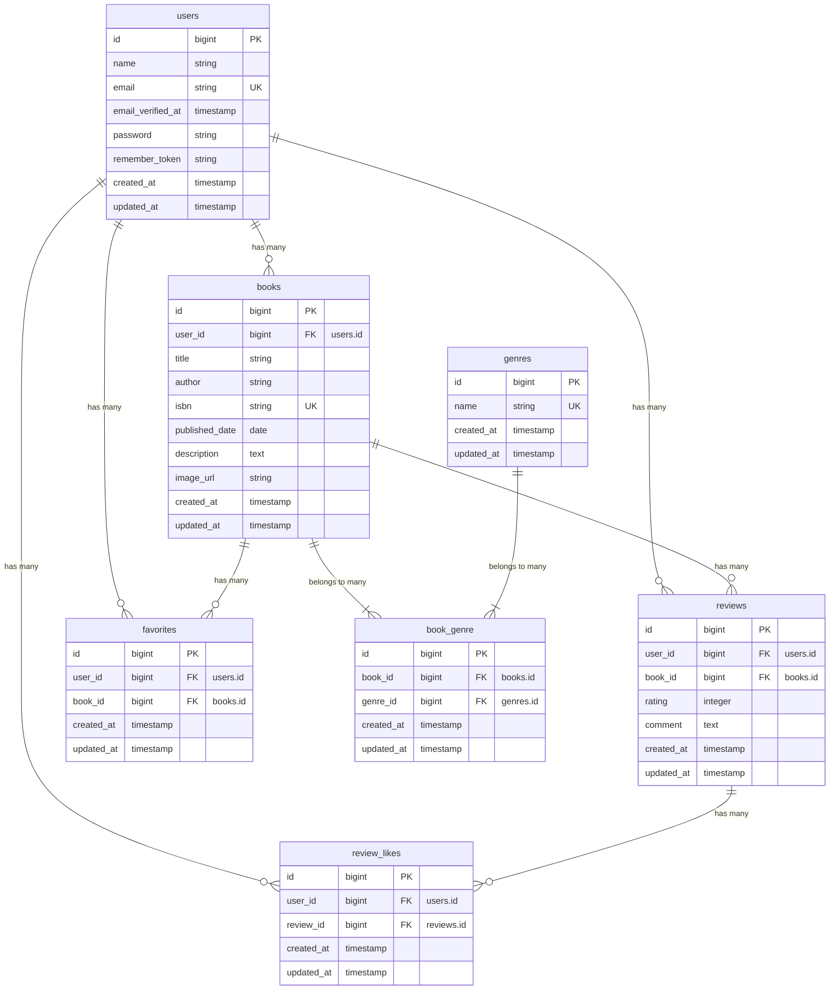

# 書籍レビューアプリケーション

書籍の登録・検索・評価レビュー、お気に入り管理、読書計画、マイ読書レポート出力などを備えた、Laravel製の書籍レビュー・読書管理プラットフォームです。

## 作成者

太田優子

## 使用技術

- PHP 8.2
- Laravel 10.x
- MySQL 8.4
- Nginx
- Docker / Docker Compose / Laravel Sail
- Tailwind CSS
- Laravel Fortify（認証）
- phpMyAdmin

## ER図



## 開発環境URL

- アプリケーション: http://localhost
- phpMyAdmin: http://localhost:8080

## 動作環境

- Docker
- Docker compose

    ※ Windowsの場合はWSL2の利用を推奨します。

## 環境構築手順

1. リポジトリをクローン

```bash
    git clone <本リポジトリのURL>
    cd <プロジェクトフォルダ名>
```

2. .envファイルの編集

    .env ファイルを開き、データベース接続情報が以下と一致していることを確認します。

```bash
    DB_CONNECTION=mysql
    DB_HOST=mysql
    DB_PORT=3306
    DB_DATABASE=laravel
    DB_USERNAME=sail
    DB_PASSWORD=password

```

3. phpMyAdmin を compose.yaml に追記

    compose.yaml を開き、mysql サービスの後に以下の設定を追加してください。

```bash
    phpmyadmin:
      image: 'phpmyadmin:latest'
      ports:
        - '${FORWARD_PHPMYADMIN_PORT:-8080}:80'
      environment:
        PMA_HOST: mysql
        PMA_USER: '${DB_USERNAME}'
        PMA_PASSWORD: '${DB_PASSWORD}'
      networks:
        - sail
      depends_on:
        - mysql
```

4. Composer依存パッケージのインストール

    プロジェクトの初回セットアップ時は、vendor ディレクトリが存在しないため sail コマンドを使用できません。 以下のDockerコマンドを実行して、コンテナ内で composer install を実行します。

```bash
    docker run --rm \
    -u "$(id -u):$(id -g)" \
    -v "$(pwd):/var/www/html" \
    -w /var/www/html \
    laravelsail/php82-composer:latest \
    composer install
```

5. Laravel Sailの起動

    以下のコマンドでDockerコンテナを起動します。

```bash
    ./vendor/bin/sail up -d
```

6. エイリアスの設定（推奨）

    毎回 ./vendor/bin/sail と入力するのは手間なので、エイリアスを設定すると便利です。

```bash
    alias sail='[ -f sail ] && bash sail || bash vendor/bin/sail'
```

7. アプリケーションキーの生成

```bash
    sail artisan key:generate
```

8. データベースのマイグレーションと初期データ投入

    以下のコマンドでテーブルを作成し、ダミーデータを投入します。

```bash
    sail artisan migrate:fresh --seed
```

    ※このコマンドの実行時にアクセス拒否等のエラーが表示される場合は、コンテナ内に過去のデータが残っている可能性があります。その場合は、以下のコマンドを順に実行して各コンテナを再起動してください。

```bash
    sail down -v
    sail up -d //コマンド実行後にSQLコンテナが立ち上がるまで時間がかかります。30秒ほどお待ちください。
    sail artisan migrate:fresh --seed
```

9. フロントエンドのビルド

```bash
    sail npm install
    sail npm run dev
```

10. アプリケーションへのアクセス

    ブラウザで http://localhost にアクセスします。

## ログイン情報（初期データ）

- **ユーザー1**
    - メールアドレス：yamada@example.com
    - パスワード：password

- **ユーザー2**
    - メールアドレス：suzuki@example.com
    - パスワード：password

- **ユーザー4**
    - メールアドレス：sato@example.com
    - パスワード：password

- **ユーザー5**
    - メールアドレス：takahashi@example.com
    - パスワード：password

## テスト実行

```bash
    sail artisan test
```

カバレッジ付きで実行する場合

```bash
    sail artisan test --coverage
```

## 機能一覧

### 認証機能

- **ユーザー登録・ログイン・ログアウト**
- **未認証アクセス制御・リダイレクト処理**

### 書籍管理・閲覧機能

- **書籍一覧表示**（10件／ページ・ゲスト閲覧可）
- **書籍キーワード検索**（タイトル・著者名の部分一致）
- **ジャンル絞込・ソート機能**（新着順・古い順・タイトル順・評価高い順）
- **書籍詳細表示**（詳細情報・レビュー一覧・いいね数表示）
- **ISBN検索による書籍情報自動入力機能**（Google Books API連携）
- **書籍の登録・編集・削除**（作成者本人のみ認可制御）

### レビュー・お気に入り・いいね機能

- **レビュー投稿・編集・削除** (評価1〜5・投稿者本人のみ認可制御)
- **レビューへの「いいね」トグル機能**
- **書籍のお気に入り追加・解除トグル機能**
- **お気に入り書籍一覧表示**（10件/ページ）

### ジャンル管理機能

- **ジャンル一覧・詳細表示**（紐づく書籍数・書籍一覧の表示）
- **ジャンル登録・編集・削除**（書籍紐付けがある場合の削除制限制御）

### ランキング・統計レポート機能

- **書籍ランキング画面**（レビュー平均評価TOP10表示）
- **マイ読書レポート表示**（/reports）
    - **基本サマリー:** 総レビュー数、読了冊数（ユニーク数）、平均評価点
    - **評価分布:** 1〜5星ごとの件数を横バー表示
    - **高評価書籍TOP5:** 4星以上の書籍を評価の高い順に表示
    - **ジャンル別評価傾向TOP5:** ジャンルごとの平均評価と件数を高い順に表示

### 読書計画・通知機能

- **読書計画管理**（一覧表示・状態絞り込み・新規作成・編集・削除・読了化）
- **通知一覧表示**（ヘッダーベルアイコン・既読化操作）
- **日次バッチ処理**（Schedule 経由での期限切れ自動ステータス変更・リマインダー通知発火）

## APIエンドポイント一覧

- 公開 API v1。読み取り系（GET）は認証不要、書き込み系（POST / PUT / DELETE）は Sanctum 認証必須で、PUT / DELETE は本人または所有者のみ操作可能。

| メソッド      | エンドポイント         | 認証 | 内容                                                                                                     |
| ------------- | ---------------------- | ---- | -------------------------------------------------------------------------------------------------------- |
| **GET**       | `/api/v1/books`        | 不要 | 書籍一覧取得（検索・絞り込み・ページネーション対応。各書籍にジャンル情報・平均評価・レビュー件数を含む） |
| **GET**       | `/api/v1/books/{book}` | 不要 | 書籍詳細取得（ジャンル・レビュー情報を含む）                                                             |
| **POST**      | `/api/v1/books`        | 要   | 書籍新規登録                                                                                             |
| **PUT/PATCH** | `/api/v1/books/{book}` | 要   | 書籍情報更新                                                                                             |
| **DELETE**    | `/api/v1/books/{book}` | 要   | 書籍情報削除（関連データも適切に処理）                                                                   |
